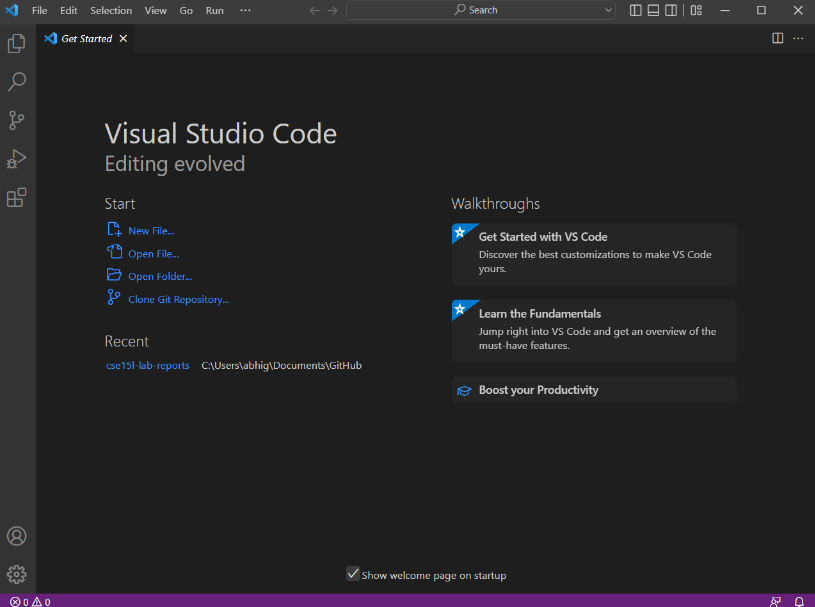

CSE15L Lab Report 1

Installing VSCode:
To install VSCode, I went to https://code.visualstudio.com/download and downloaded the installer for my respective operating system(I use Windows). I then followed the instructions on the installer in order to complete the installation for VSCode. After this, I launched VSCode and opened a window that looked like this:

Remotely Connecting:
Because I am using Windows, I needed to install OpenSSH(just the client). To do this I went into the “Add an optional feature” tab in settings and added “OpenSSH Client”.

Then in VSCode, I opened up a terminal and was supposed to type in “ssh cs15lfa22oo@ieng6.ucsd.edu” in the terminal(the “oo” is specifically for my account). However, because I was unable to connect to the server with this account(likely because the password reset takes a while for it to register in the system) I checked with a TA and was permitted to use the account “aganga@ieng6.ucsd.edu” instead. Once connected, I got this message:

This means that the terminal is connected to a UCSD computer.

Trying Some Commands:
For this step, I decided to run some commands. Some of the options for commands to run were cd, ls, pwd, mkdir, and cp. The example I show below specifically show me using the ls and cd commands:

ls is used to list the directories/files and cd lets us change directories. In this example I used ls to display the directories/files and cd to switch into per15.

Moving Files with scp:
For this step, I first created a file called WhereAmI.java

and saved it to my computer. I then ran the program using “javac WhereAmI.java” and “java WhereAmI”. Then in the terminal, I typed: “scp WhereAmI.java aganga@ieng6.ucsd.edu:~/” and logged in using my password. I then ran the same program on the remote computer and it looked like this:

The program essentially displayed a different operating system, user name, user home, and directory compared to when I ran the program locally on my computer.

Setting an SSH Key:
For the setup, I ran this:

From there, I logged into the ieng6 computer and typed, “mkdir .ssh”. And then back on the client, I typed: “scp \Users\abhig/.ssh/id_rsa.pub aganga@ieng6.ucsd.edu:~/.ssh/authorized_keys”. Completing this step now means that I can use ssh/scp without having to enter a password every time.

Optimizing Remote Running:
One way we can optimize remote running is by writing our command in quotes at the end of the ssh command. For this example, I used the ls command to display the directories on the ieng6 computer(I performed this step early on, hence why I still needed to include a password).
 

