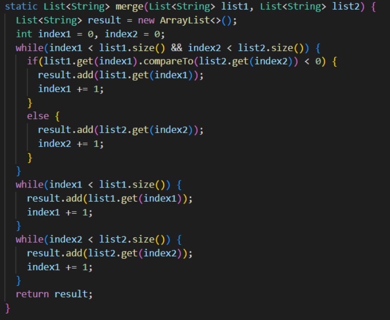

# Lab Report 2
## Part 1
In week 2, we were assigned to create the simplest "search engine"  that implements a web server that tracks a list of strings. This search engine has the ability to add a new string to a list and returns a list of strings given a specific substring.

**Here is the code for the search engine:**
```java
import java.io.IOException;
import java.net.URI;
import java.util.*;

class Handler implements URLHandler {
    int num = 0;
    List<String> stringList = new ArrayList<String>();

    public String handleRequest(URI url) {
        if (url.getPath().equals("/")) {
            return String.format("");
        } else if (url.getPath().contains("/add")) {
            String[] parameters = url.getQuery().split("=");
            stringList.add(String.format(parameters[1]));
            return (String.format(parameters[1]) + " added!");
        } else if (url.getPath().contains("/search")) {
            List<String> newList = new ArrayList<String>();
            String[] userSearch = url.getQuery().split("=");
            for (int i = 0; i < stringList.size(); i++) {
                if (String.format(stringList.get(i)).contains(String.format(userSearch[1]))) {
                   newList.add(String.format(stringList.get(i)));
                }
            }
            return (Arrays.toString(newList.toArray()));
        }
        return "";
    }
}

class SearchEngine {
    public static void main(String[] args) throws IOException {
        if(args.length == 0){
            System.out.println("Missing port number! Try any number between 1024 to 49151");
            return;
        }

        int port = Integer.parseInt(args[0]);

        Server.start(port, new Handler());
    }
}
```
The next 3 screenshots represent how I added elements to the overrall list that will later be searched for a specific susbtring.


In these cases, the method "handleRequest" is being used. When I type "add?s=" into the URL in my browser the string/word that comes after the "=" gets added to stringList. From there, the string that was added to stringList is also printed on the screen followed by " added!" to let the user confirm that the string has been added.

Since all 3 screenshots represent the add function, I will use the first screenshot(the one with the string: apple) to explain the code. Once apple is added to the URL as seen in the screenshot, the string of the URL gets set equal to String[] parameters. The string that comes after the "=" in the URL is at index 1 so "stringList.add(String.format(parameters[1]))" is performed to add the string(in this case "apple") to stringList. The string is then returned with " added!" to let the user confirm the addition of the string.


In the picture above as well, the method "handleRequest" is being used. Because the URL contained "/search", the code worked differently compared to when "/add" was used. In this case, similar to the last few pictures, the string of the URL gets set equal to String[] userSearch and to specifically find the string, we would need to look at the first index of userSearch. Then, a for loop runs to iterate through stringList(because we already added the strings to the list each time we input "/add" in our browser) and searches for whether or not the subtring(in this case it is "app") is contained within the strings in stringList. The strings that do contain the substring("app"), get added to newList and then displayed back to the user on the browser.


## Part 2
**BUG #1**

The first bug I will discuss comes from the method "reverseInPlace" from ArrayExamples.java. 

**The failure-inducing input:**


**The symptom:**


**The bug:**

The original code:


The fixed code:


**BUG #2**

The second bug I will discuss comes from the method "merge" from ListExamples.java. 

**The failure-inducing input:**


**The symptom:**


**The bug:**

The original code:



The fixed code:


