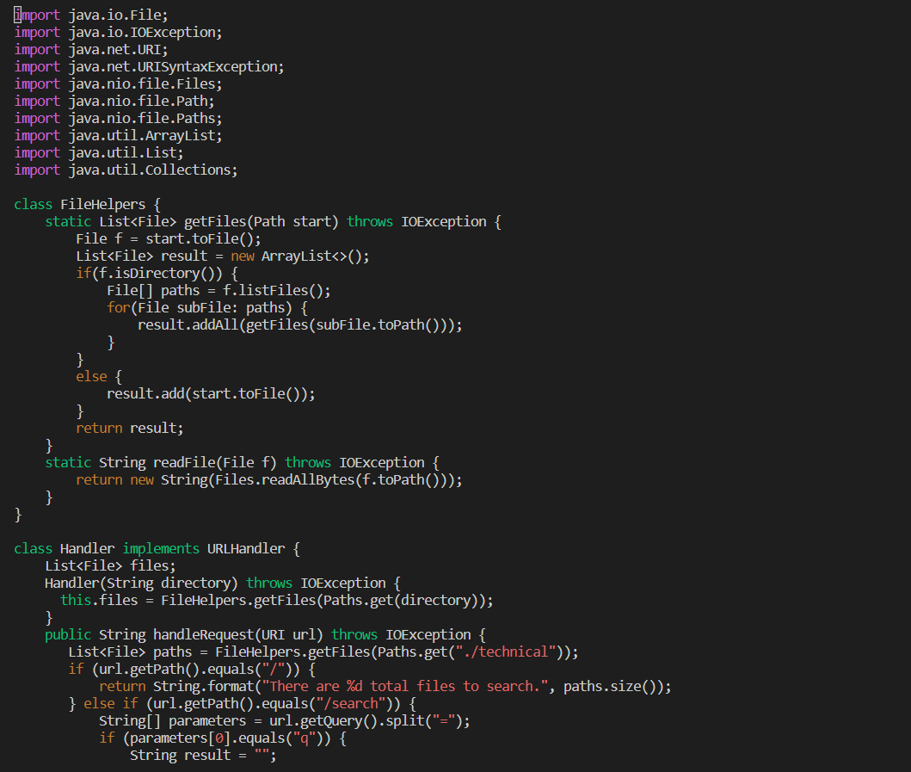
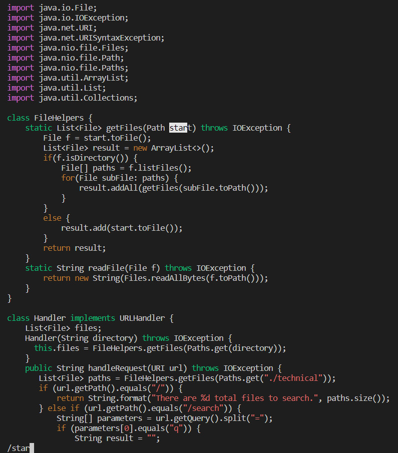
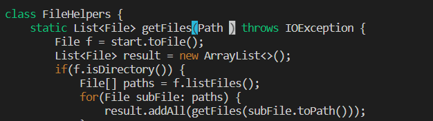
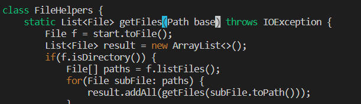
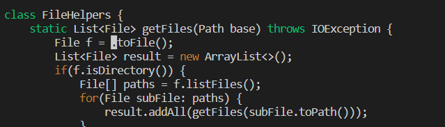
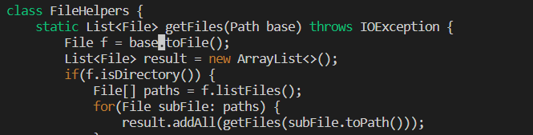
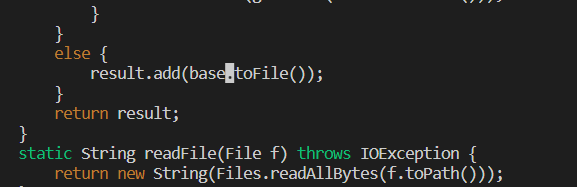

# Lab Report 4
## Part 1

For this part, I chose the task of changing the name of the start parameter of getFiles, and all of its uses, to instead be called base in DocSearchServer.java. 

Here is a sequence of vim commands in order to complete this task:

```
vim DocSearchServer.java
type "/star"
Type "dw"
<Enter>
Type "base"
<Esc>
type "yiw" 
<Enter>
type "/star"
Type "dw"
Type "p"
<Esc>
type "/star"
Type "dw"
Type "p"
:w<Enter>
```


Here is a step by step breakdown of the vim commands provided above:


Typing the first command "vim DocSearchServer.java" in terminal brings this result:



Typing the second command "/star" highlights the first word with "star" in it and it looks like this:



Typing the third command "dw" ends up deleting the word("start") that was highlighted previously:



From here, you enter the word "base" and it the end result should look like this:



The next step, typing "yiw" doesn't make any visual changes but typing "yiw" while the cursor is still on the word "base" will essentially yank the word(this will be utilized later to paste the same word).

For the next steps, typing "/star" and dw will essentially get to the next "star" in the file and delete the word at that position(the change was made at the position of where my cursor is):




For the next step, typing "p" at the position of the cursor will paste the word "base" and the result will look like this:




The next few steps(up to type "p") essentially just repeat this process but for the next word "start" that occurs in the code. The result of these repeated steps will look like this:




The final command :w<Enter> will save the changes you made.

Performing this set of tasks ensures that DocSearchServer.java is altered to look like this:
```
import java.io.File;
import java.io.IOException;
import java.net.URI;
import java.net.URISyntaxException;
import java.nio.file.Files;
import java.nio.file.Path;
import java.nio.file.Paths;
import java.util.ArrayList;
import java.util.List;
import java.util.Collections;

class FileHelpers {
    static List<File> getFiles(Path base) throws IOException {
        File f = base.toFile();
        List<File> result = new ArrayList<>();
        if(f.isDirectory()) {
            File[] paths = f.listFiles();
            for(File subFile: paths) {
                result.addAll(getFiles(subFile.toPath()));
            }
        }
        else {
            result.add(base.toFile());
        }
        return result;
    }
    static String readFile(File f) throws IOException {
        return new String(Files.readAllBytes(f.toPath()));
    }
}

class Handler implements URLHandler {
    List<File> files;
    Handler(String directory) throws IOException {
      this.files = FileHelpers.getFiles(Paths.get(directory));
    }
    public String handleRequest(URI url) throws IOException {
       List<File> paths = FileHelpers.getFiles(Paths.get("./technical"));
       if (url.getPath().equals("/")) {
           return String.format("There are %d total files to search.", paths.size());
       } else if (url.getPath().equals("/search")) {
           String[] parameters = url.getQuery().split("=");
           if (parameters[0].equals("q")) {
               String result = "";
```

## Part 2
For part 2, I will essentially be performing the task I did above but in two ways. One by just using my VSCode and then I will scp the edited file to the remote computer or two by editing the file in Vim.

For method 1, it took me 15.44 seconds to create the changes and type in the scp command into my terminal(I did not count the time it takes to actually scp the file). For method 2, it took me 44.24 seconds to make all the changes in vim and then exit vim.

Despite the fact that method 2 took longer, I would probably still prefer method 2 if I was working on a program that I was running remotely. One reason for this is that scp takes a while to actually transfer the file to the remote computer and using method 2 eliminates this issue. Another reason is that vim is still a relatively new concept to me so I'd like to think that over time, I would get faster utilizing the vim commands and hopefully work to close the gap/disparity in times between the two methods. Something that I would consider when making the decision between these 2 methods is how big the files/directories I have to scp are. If they aren't too big, then I could likely just use method 1 since the scp time won't be too high but if there was a lot to scp, then I would likely use method 2 in order to save time.

