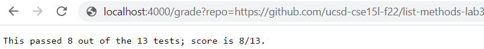
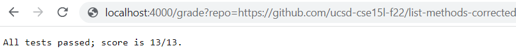
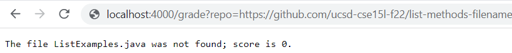

# Lab Report 5
For Lab Report 5, we worked to create an autograding script to grade for a set of list method submissions.
```
# Create your grading script here

rm -rf student-submission
git clone $1 student-submission
cp TestListExamples.java student-submission
cd student-submission

if [[ ! -f ListExamples.java ]]
then
    echo "The file ListExamples.java was not found; score is 0."
    exit 0
fi

javac ListExamples.java 2> error.txt
EXIT=$?

javac -cp .:../lib/hamcrest-core-1.3.jar;../lib/junit-4.13.2.jar TestListExamples.java

if [[ $(grep -c "^OK" test.txt) -eq 1 ]]
then
    totalNumTests=$(grep -Po "\d+ test" error.txt | grep -Po "\d+")
    echo "All tests passed; score is ${totalNumTests}/${totalNumTests}."
else
    totalNumTests=$(grep -Po "Tests run: \d+" error.txt | grep -Po "\d+")
    testsFailed=$(grep -Po "Failures: \d+" error.txt | grep -Po "\d+")
    testsPassed=$((totalNumTests - testsFailed))
    echo "This submission passed ${testsPassed} out of ${totalNumTests} tests; score is ${testsPassed}/${totalNumTests}."
fi
```

For the first example, I used https://github.com/ucsd-cse15l-f22/list-methods-lab3. Here is the output I received:



For the second example, I used https://github.com/ucsd-cse15l-f22/list-methods-corrected. Here is the output I received:



For the third example, I used https://github.com/ucsd-cse15l-f22/list-methods-filename. Here is the output I received:


For this lab report, I will be using example 3 to trace the script. The first 4 lines of code ran perfectly fine(exit code of 0). The first line gets rid of any pre-existing stedent submission. Line 2 then clones the new given repository. Line 3 copies the tester file and line 4 moves us into the new directory.
Now we get to the very first if statement. This if statement checks if there is not a file named ListExamples.java in our current working directory. Since in this case, the if statement is true(in that there is no file labeled ListExamples.java), it jumps to the then statement. From there, it echoes the line "The file ListExamples.java was not found; score is 0." and exits with an exit code of 0.
